# User Manual - TraderLog Pro v1.1

## 1. Overview and Fundamental Concepts

**TraderLog Pro** is not just a trade journal; is a financial intelligence station designed to professionalize individual traders. Our philosophy is based on centralizing data to transform “sentiment” into actionable statistics.

### 1.1. The Three Pillars of Success
To achieve consistency, the software works simultaneously on three fronts:
1. **Operational Pillar (The Engine)**: Complete automation of journaling via RTD. You operate, we record, calculate and classify in real time.
2. **Psychological Pillar (The Mind)**: Where mathematics meets emotion. We track your mental state to identify whether your losses are technical or behavioral.
3. **Fiscal Pillar (The Compliance)**: Legal and tax security. We generate your DARFs and control exemptions automatically, eliminating the fear of fine mesh.

### 1.2. Local-First Architecture (Privacy by Design)
Unlike web platforms, TraderLog Pro operates under the **Local-First** model:
- **Total Privacy**: Your financial data and strategies never leave your machine. There are no central servers that can be hacked or that sell your data.
- **Elite Encryption**: Everything is stored in local **SurrealDB**, protected by **AES-256** encryption.
- **Offline Performance**: The app works 100% without internet to consult and analyze historical data.

### 1.3. Real-Time Integration (RTD Bridge)
The centerpiece of our automation is the **PowerShell Bridge**. It acts as a universal translator that listens to your platform (ProfitChart, MetaTrader, etc.) and feeds TraderLog Pro in milliseconds, eliminating human error and laziness in filling out spreadsheets.

### 1.3. Setup Engine (9 Step Guide)
When starting for the first time, the wizard will guide you through:
1. **Visual Preferences**: Language and Theme.

2. **Profile and Security**: Creation of a cryptographic password.

3. **Master Key**: Generate and save your 24-word key.

4. **License**: Activate your Premium access.

5. **Base Currency**: Define the currency of your financial life.

6. **Markets**: Select where you operate.

7. **Types of Assets**: Stocks, Futures, Options.

8. **RTD Connection**: Enable automatic monitoring.

9. **Finishing**: Start of the journey.

---

## 2. System Settings (Post-Start Flow)

The Settings area is divided into logical sections for easy management. Access via the gear icon in the footer of the side menu.

### 2.1. GENERAL

#### 2.1.1. Profile
Manage personal information (Name, CPF) and language and time zone preferences.

#### 2.1.2. License
Track the status and validity of your subscription.
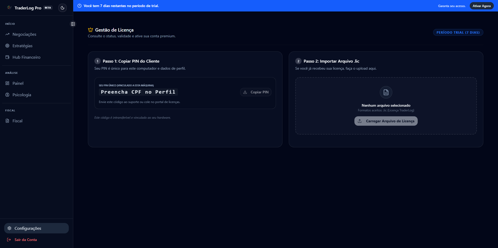

### 2.2. REGISTRATIONS

#### 2.2.1. Accounts
Register your brokers or proprietary desks. **Required to register trades.**

**How ​​to add:**
1. Click the **"New"** button at the top of the list.
2. Fill in the broker name, account number and select the currency.
3. Click **"Save"**.

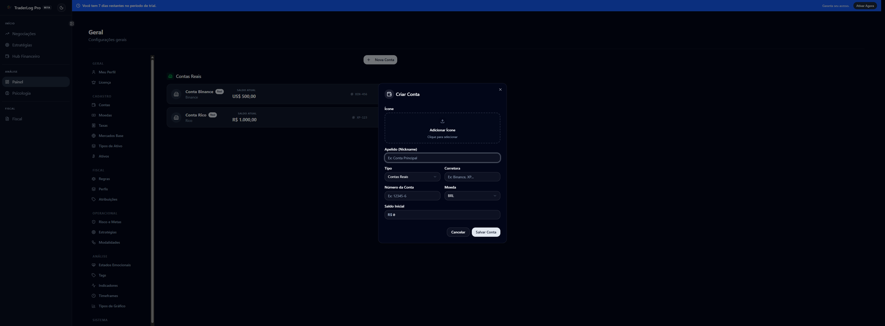

#### 2.2.2. Coins
Manage currencies and exchange rates against your base currency.

**How ​​to add:**
1. Click **"New"**.
2. Set the code (Ex: USD, EUR), name and current conversion rate.
3. Click **"Save"**.

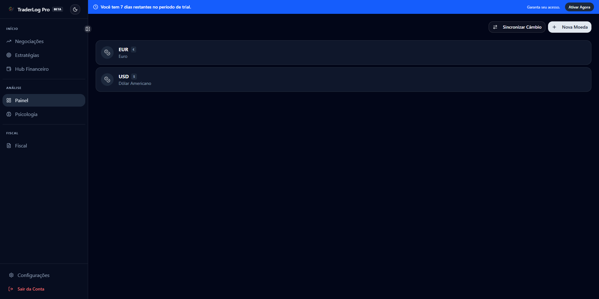

#### 2.2.3. Markets
Define time zone and trading windows (B3, NYSE, etc.).

**How ​​to add:**
1. Click **"New"**.
2. Enter the name (Ex: B3), time zone and opening and closing times.
3. Click **"Save"**.

#### 2.2.4. Types of Assets
Categorize the roles and define whether the PnL will be in finance or points.

**How ​​to add:**
1. Click **"New Type"** at the top of the list.
2. Define the name (Ex: Shares, Index), the market and how the result should be displayed (Financial or Points).
3. Click **"Save"**.

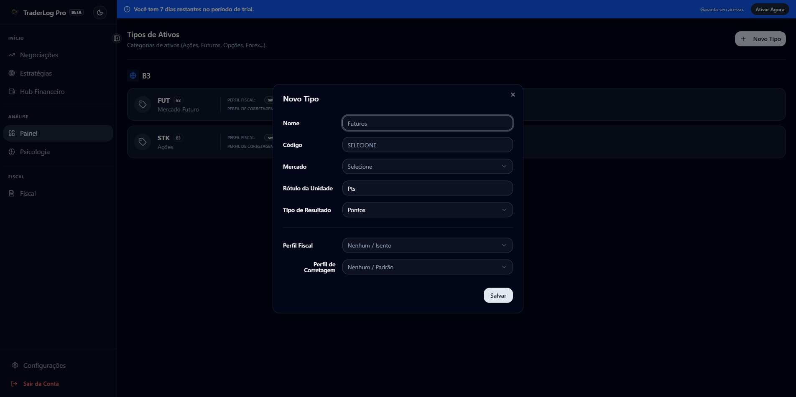

#### 2.2.5. Assets
Register individual tickers (PETR4, WDO) and define the point weight.

**How ​​to add:**
1. Click **"New Asset"** at the top of the list.
2. Enter the Symbol (Ticker), Friendly Name and select the Asset Type.
3. Configure the Point Value (necessary for calculating PnL in contracts).
4. Click **"Save"**.

#### 2.2.6. Fees & Fees
Set up brokerage costs and exchange fees.

**How ​​to add:**
1. Click **"New Rate"**.
2. Define a name for the rates profile.
3. Enter the brokerage values ​​(per order or contract) and the fees and ISS rates.
4. Click **"Save"**.

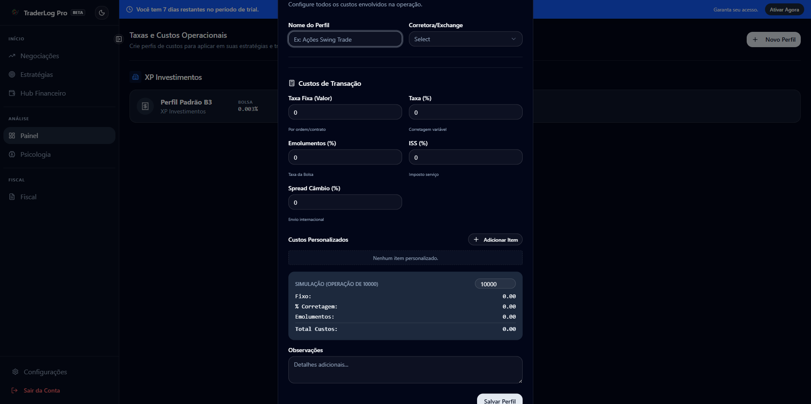

### 2.3. TAX

#### 2.3.1. Tax Rules
Define rates (Day Trade 20%, Swing 15%) and exemption limits.

**How ​​to add:**
1. Click **"New Rule"**.
2. Choose the Market and Asset Type.
3. Define the Day Trade and Swing Trade rates.
4. Enter the revenue code (DARF) and exemption limits, if any.
5. Click **"Save"**.

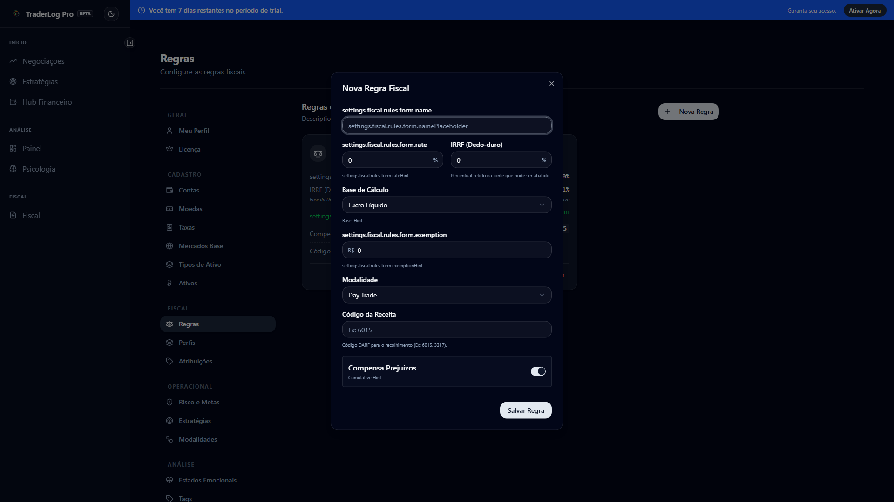
#### 2.3.2. Tax Profiles
Group rules into profiles (Ex: "Brazil Standard").

**How ​​to add:**
1. Click **"New Profile"**.
2. Define a name (Ex: Swing Trade Shares).
3. Select the tax rules that make up this profile.
4. Click **"Save"**.

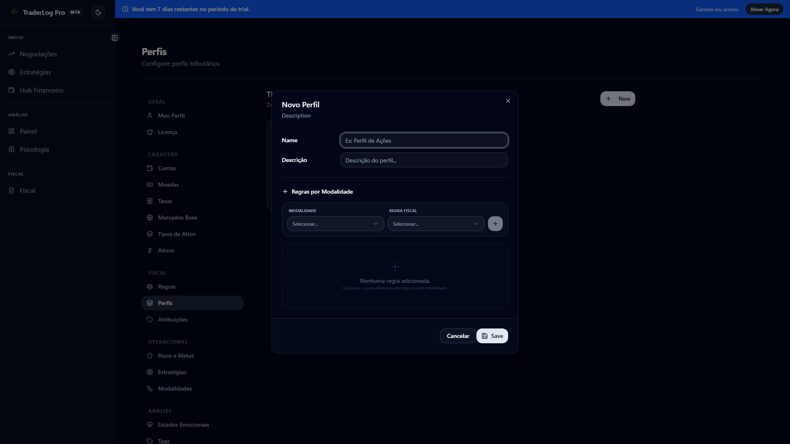

#### 2.3.3. Duties
Link tax profiles to specific accounts or asset types.

### 2.4. OPERATIONAL

#### 2.4.1. Risk Profile
Set Daily Stop Loss, Goals and the **Growth Plan** to protect your capital.

**How ​​to add:**
1. Click **"New Profile"** on the Risk Profiles screen.
2. In the form, fill in the settings divided into three tabs: General, Risk Engine and Growth.
3. Click **"Save"** to apply the rules.

**Tab: General**
Basic limit and objective settings.

* **Daily Loss Limit:** Maximum amount you accept to lose on the day. When reached, the platform may halt further operations.
* **Daily Goal:** Earning objective for the day.
* **Maximum Risk per Operation (%):** Acceptable loss limit in a single entry.
* **Maximum Number of Trades:** Limit of operations per day to avoid overtrading.
* **Lock on Reaching Loss:** If activated, prevents new orders from being opened after the daily stop.

***

**Tab: Risk Engine**
Advanced intelligence and discipline capabilities.

* **Psychological Coupling:** Reduces hand size automatically if it detects a sequence of losses or erratic behavior.
* **Outliers Regression:** Identifies unusual gains that can generate overconfidence and adjusts risk.
* **Sniper Mode:** Increases the selectivity required for new entries based on your history.

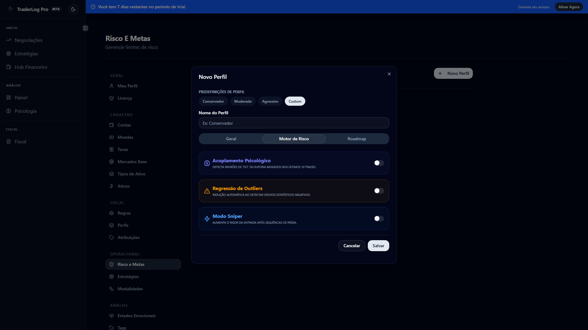

***

**Tab: Growth Plan**
Scale your batches mathematically and safely.

* **Enable Plan:** Activates automatic batch progression.
* **Phases:** Define how many contracts/lots to operate at each level and the rules for moving up or down in phases (Ex: 5 positive days to go up).

#### 2.4.2. Modalities
Categorize the time of operations (Scalping, Swing, DT). **Vital for tax calculation.**

**How ​​to add:**
1. Click on **"New Modality"**.
2. Enter the name (Ex: Scalping, Day Trade).
3. Select the corresponding tax calculation type.
4. Click **"Save"**.

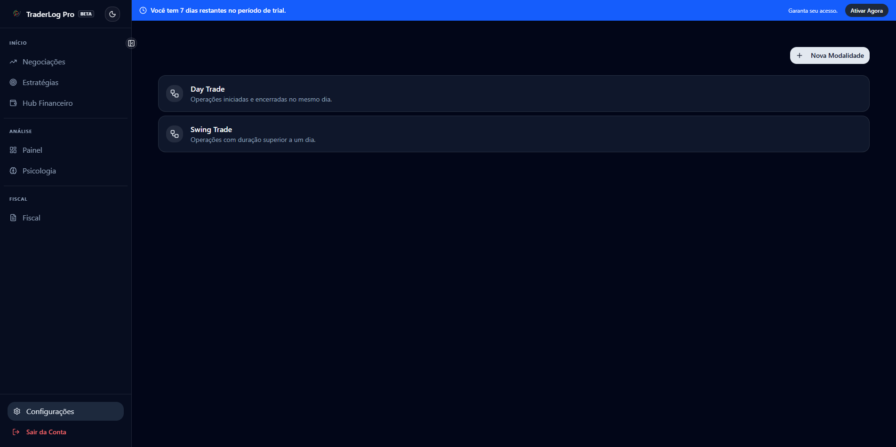

### 2.5. ANALYSIS

#### 2.5.1. Emotional States
Map your mood (Focus, Anxiety, Revenge) and the weight in your result.

**How ​​to add:**
1. Click **"New Status"**.
2. Name the emotional state.
3. Define an icon and impact (Positive, Neutral or Negative).
4. Click **"Save"**.

#### 2.5.2. Tags
Free labels for context (News, Operational Error).

**How ​​to add:**
1. Click **"New Tag"**.
2. Enter the tag name.
3. Choose a color for visual identification.
4. Click **"Save"**.

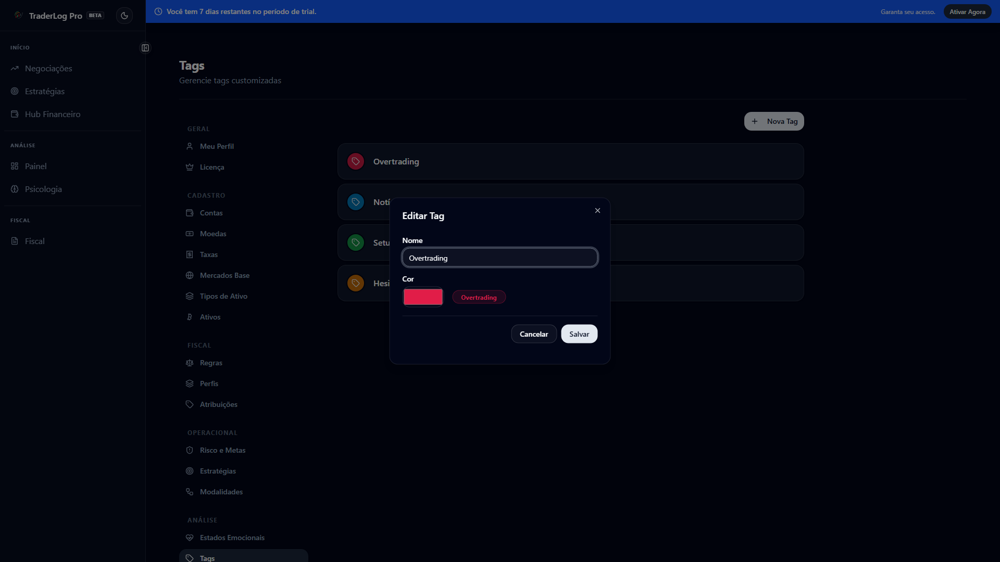

#### 2.5.3. Indicators
Document the technical tools (VWAP, Averages) used in the setups.

**How ​​to add:**
1. Click on **"New Indicator"**.
2. Name the technical indicator.
3. (Optional) Add a brief technical description.
4. Click **"Save"**.

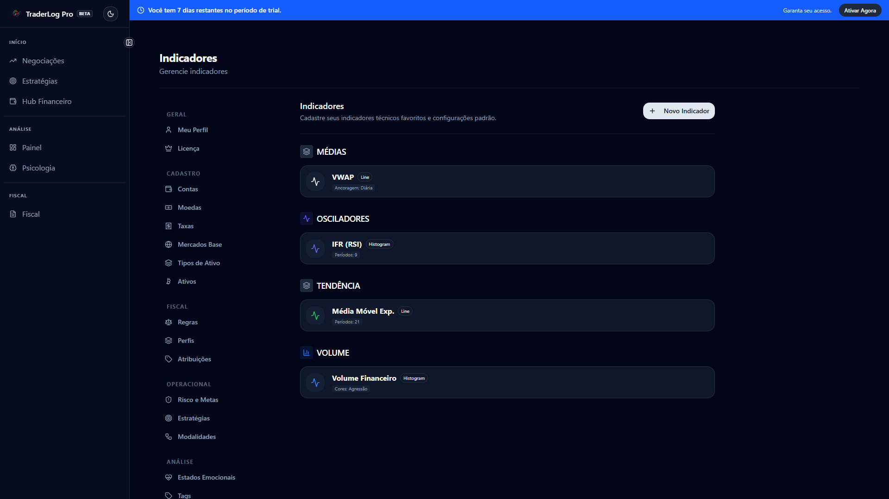

#### 2.5.4. Timeframes
Set the graphic times (1min, 5min, 60min).

**How ​​to add:**
1. Click **"New Timeframe"**.
2. Set the numeric value and unit (Minutes, Hours, Days).
3. Click **"Save"**.

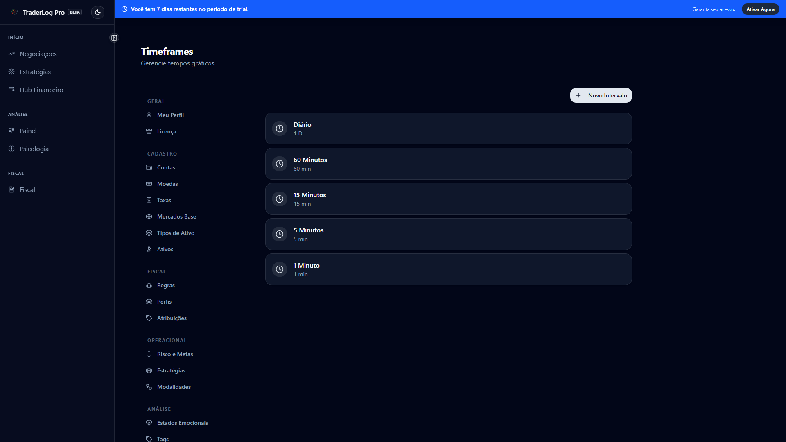
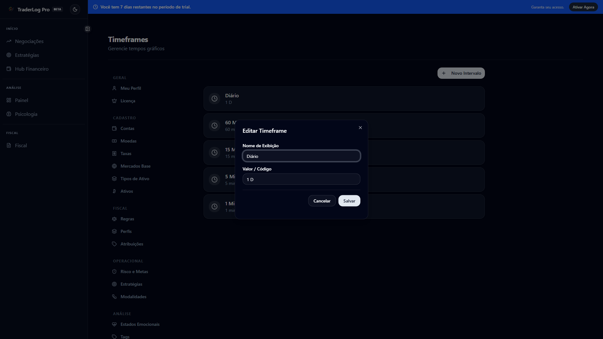

#### 2.5.5. Chart Types
Choose the price reading method (Candle, Renko, Flow).

**How ​​to add:**
1. Click **"New Type"**.
2. Name the chart style (Ex: Renko 10R).
3. Click **"Save"**.

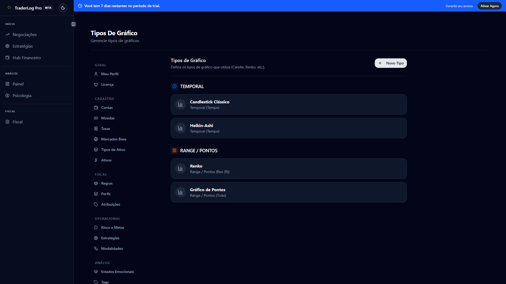

#### 2.5.6. Strategies
Document your setups with triggers, checklists, and visual examples to maintain operational consistency.

**How ​​to add:**
1. Click **"New Strategy"**.
2. Define the **Name** (Ex: Pivot Break) and a brief **Description**.
3. Select the **Markets**, **Timeframes**, **Asset Types** and **Specific Assets** (optional) where the strategy applies.
4. Go to the **Validation Checklist** tab and define the Entry Criteria, Exit Criteria and Driving Rules.
5. If the strategy has partial achievements, activate the option **"Allow Partial Realization"** and describe the goals.
6. (Optional) In the **Visual Examples** tab, upload reference images (max: 5).
7. Click **"Save"**.

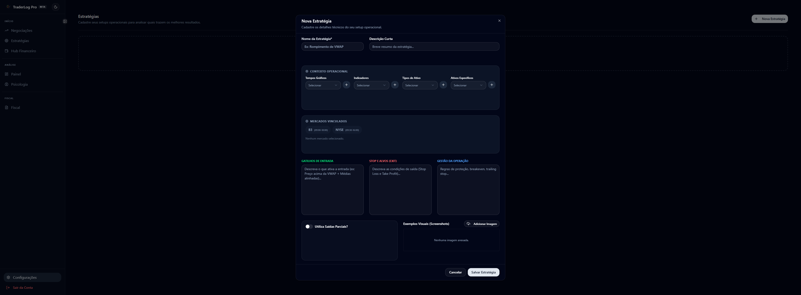

---

## 3. Navigation and Interface (The Cockpit)

### 3.1. Dashboard
360º view of your financial health. Includes Equity Curve, Traffic Light Calendar and the 4 Kash Cards (Balance, Net PnL, Win Rate and Discipline).
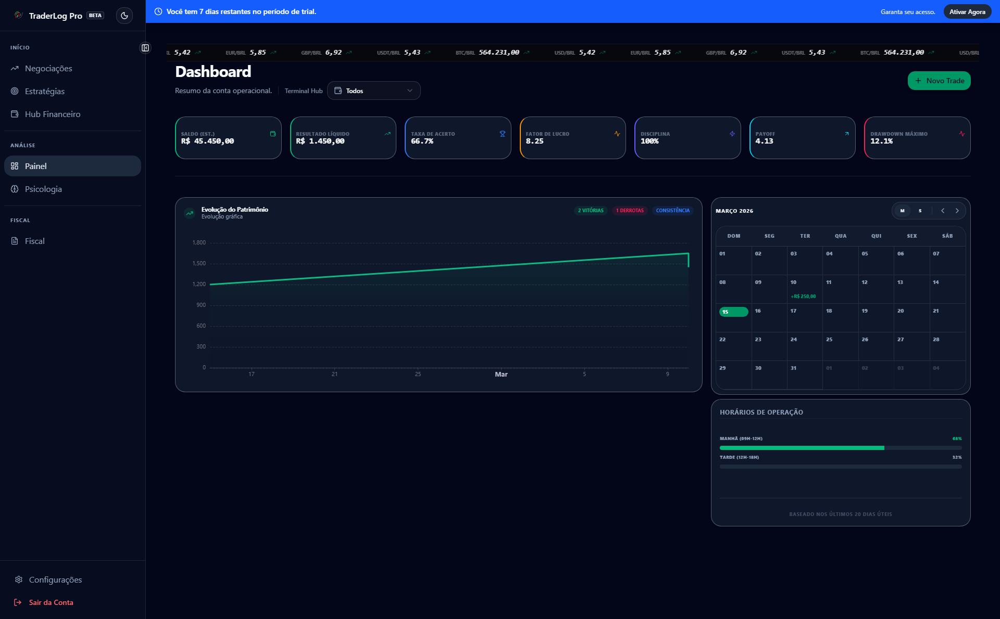

### 3.2. Sidebar
Navigation divided between Operational Core (Trades/Mind), Treasury (Banks/Assets), Fine Mesh (Tax) and Engine Room (Settings).

---

## 4. Operating Ecosystem (Daily Use)

### 4.1. Negotiations (Trades)
The chronological tree where Auto-Journaling centralizes its operations imported via RTD or launched manually.

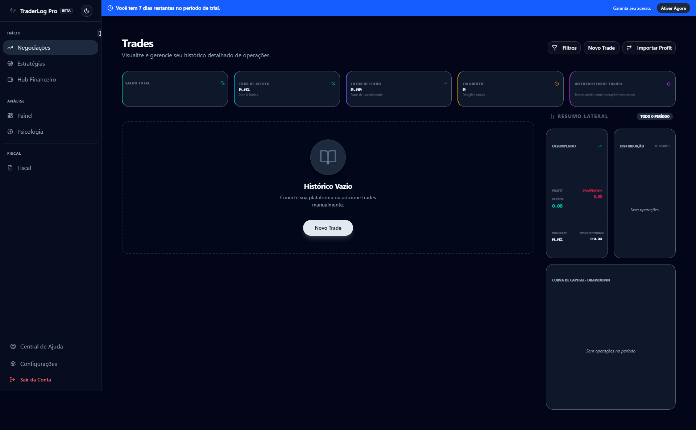

**How ​​to add manually:**
On the Trades screen, click on the **"New Trade"** button to open the smart form in 5 steps:

#### Tab 1: Basics (Operation Context)
The first step defines the "Where, What and When" of your operation. Fill in the essential details so that the system can calculate and catalog the trade:
* **Account:** The broker or bank where the operation was executed (e.g. XP, BTG).
* **Strategy:** The operational setup that motivated the entry (e.g. Average Crossover, Breakout).
* **Graphic Time:** The graph time (Timeframe) used to read the input (ex: 5m, 60m, Daily).
* **Volatility:** Your perception of how the market was (Normal, High, Extreme).
* **Asset Type:** A quick filter to facilitate the search for the asset (Shares, Futures, Forex).
* **Asset / Contract:** The ticker traded (ex: WINM26, PETR4, EURUSD).
* **Direction:** If the operation was initiated at the Buyer (Long) or Seller (Short) end.
* **Date and Time:** The exact moment the order was executed at the broker.
* **Entry Price:** The average initial price filled in on the ticket.
* **QTD (Quantity):** The number of shares, mini-contracts or lots traded.
* **Emotional:** The emotion or feeling you were experiencing moments before clicking the button.
* **Modality:** The tax and temporal risk profile (Day Trade for operations started and closed on the same day, or Swing Trade).
* **Stop Loss (Optional):** Your maximum defense price positioned at the broker.
* **Take Profit (Optional):** The projected final target for gain.

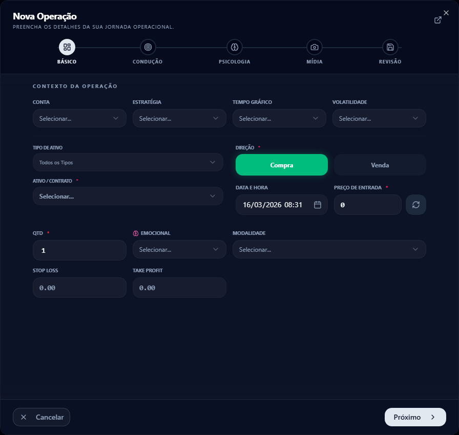

#### Tab 2: Driving (Partial and Exit Management)
The second step is focused on risk management during the trade and settlement of the operation. Detail how you handled the position and close the record:
* **Executed Volume / Remaining:** Monitors how many contracts/lots of your main position have already been closed and how many are still pending.
* **Output/Add Toggle:** Choose the type of partial you want to record. "Exit" for profit realizations (partial Take Profit) or loss reduction. "Addition" for position increases (Average Price for or against).
* **Button + Add Partial:** Opens a sub-form to fill in the Date/Time, Price, Quantity and Observations of the registered leg.
* **Partial Table:** Grid history chronologically listing all legs of your operation, calculating your New Average Price and the individual financial result of each partial.
* **Open / Close Toggle (Closing Data):** The master key of the trade. Marking as "Closed", the platform liquidates any remaining balance in your position and displays the final closing fields:
  * **Departure Date and Time:** Time of final settlement.
  * **Exit Price:** Price that reset the main position.
  * **Costs / Fees:** Completion of broker/exchange operating fees (if your Tax Profile has not already been auto-calculated).
* **Net Result Card:** A real-time panel that consolidates the mathematics of your entries, additions, partial exits and final exit, displaying your projected Profit or Loss.

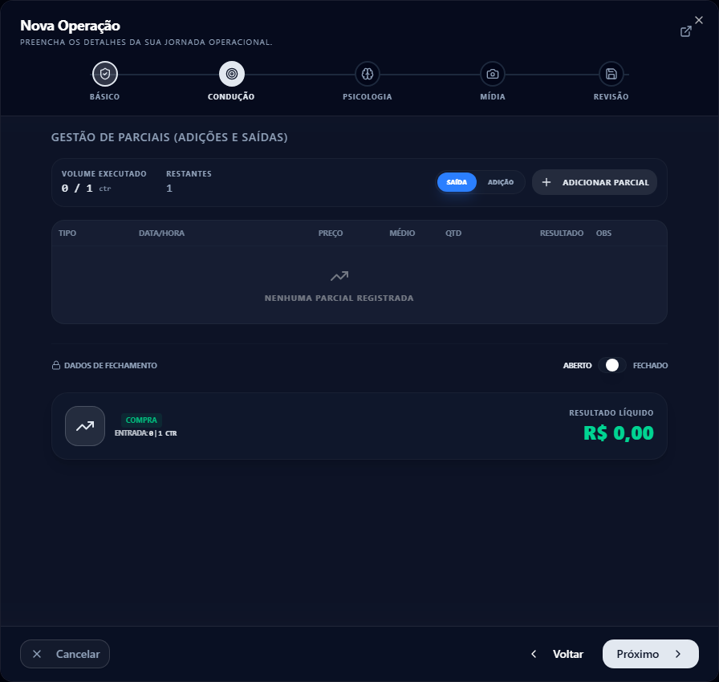

#### Tab 3: Psychology (Contextual Analysis)
The "Logbook" (Journaling). This qualitative step is crucial so that behavioral crossover algorithms can identify what makes money and what generates losses in your emotions. Fill in:
* **Input Rationale:** A free text explaining *why* you decided to open the operation.
* **Confirmation Signals:** Technical detail. What exact triggers did your setup validate?
* **Market Context / News:** What was the macro sentiment at the time? In favor of the trend? Was it influenced by any news?
* **What worked / Improvements:** A post-trade assessment of what was left of practical learning from execution.
* **Emotional Intensity:** An impact slider (0 to 10). How strong was the emotion (Mild, Moderate, Extreme) that you registered there in Tab 1? Ex: Anxiety level 10 will destroy your patience to hold a gain.

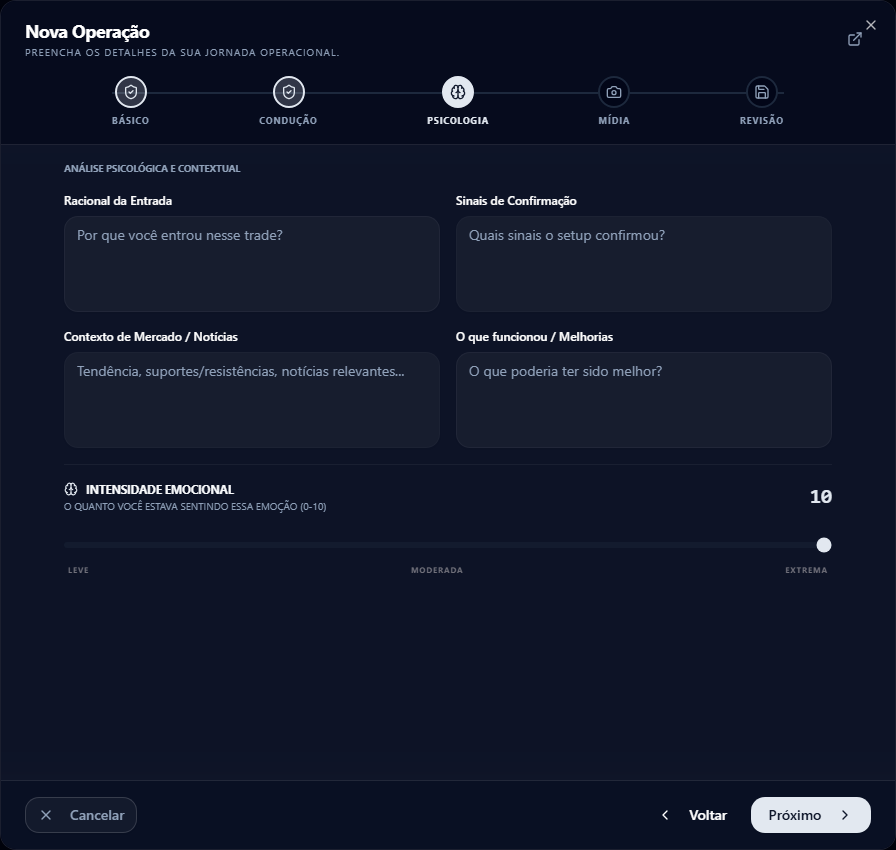

#### Tab 4: Media (Visual Evidence)
A repository of visual evidence of your operations. Record images to facilitate future audits and studies.
* **Upload Area (Drag or Click):** Allows you to add up to 5 Megabytes (Max 5MB) of screenshots. Ideal for uploading ProfitChart or TradingView prints showing exactly where you entered, where the stop was, and where you exited.

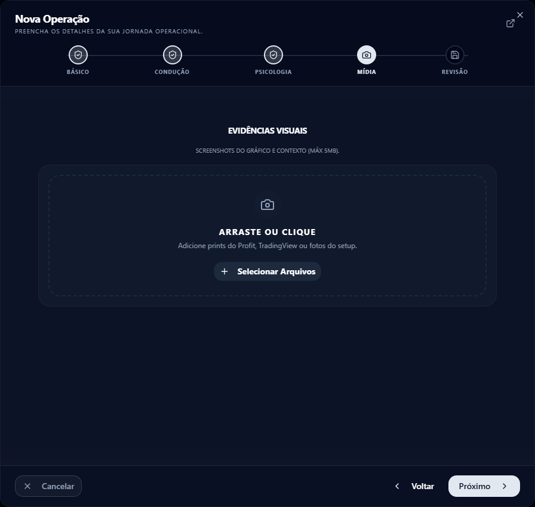

#### Tab 5: Review (Final Summary)
The last step acts as a cold audit before you consolidate the data into the source database.
* **Summary Table:**
  * **Asset / Direction:** Validates the ticker and whether it was Buy/Sell.
  * **Result:** The final financial PnL already processed.
  * **Date & Strategy:** Confirmation of calendar and method used.
  * **Images:** Number of attachments saved in Tab 4.
  * **Did you follow the Plan?:** A vital check! The system uses this Boolean variable (Yes or No) to feed the Adherence and Discipline statistics from the Strategy Dashboard!
* **Calculation Memory:**
  * **Gross Result vs Fees:** The system shows how much money was left in the market through operating fees compared to what was actually gained in the change in the asset (Net Balance = Gross - Fees).
* **Save / Finish button:** Completes and definitively inserts the operation into your history.

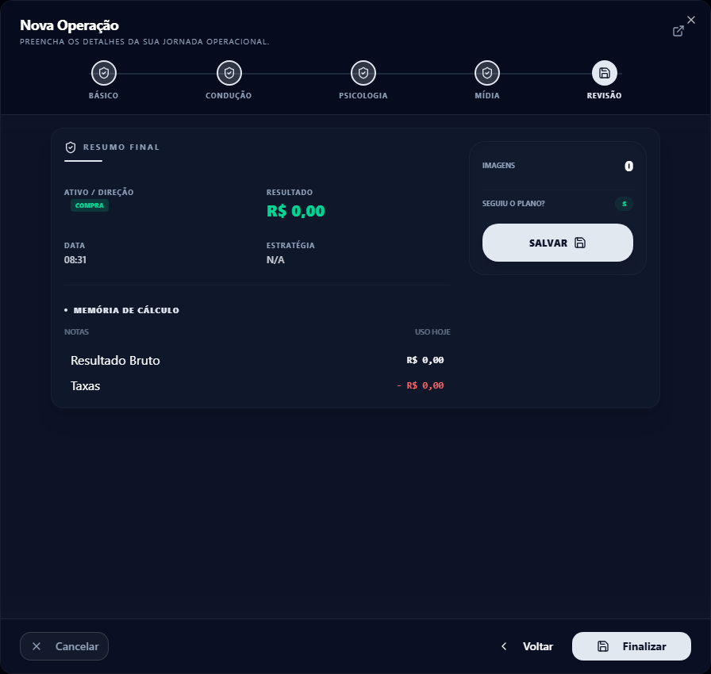

### 4.2. Hub Strategies
The central hub for setup intelligence. This is where you statistically analyze which setup really pays your bills, allowing you to discard what doesn't work and leverage what works.

#### Strategy Dashboard (Deep Analysis)
When clicking on a specific strategy, you access a mathematical X-Ray focused purely on the metrics derived from the operations where this strategy was applied. The screen is made up of the following modules:

* **Equity Chart (Strategy):** The equity curve (Equity Curve) generated exclusively by the executions of this setup.
* **Drawdown Chart:** Displays the strategy's loss valleys, helping to measure the risk and recovery time between capital peaks.
* **Heat Map (P&L):** A Time vs Day of the Week matrix that reveals exactly at which times or days the strategy is statistically more profitable (green dots) or more dangerous (red dots).
* **Main Metrics (Side Column):**
  * **Net Result:** The total financial balance (profit minus losses and costs) of the strategy.
  * **Win Rate:** The percentage of times the strategy closed in profit.
  * **Profit Factor:** Ratio between gross profit and gross loss. (Metrics above 1 indicate profit).
  * **Payoff:** The average gain on wins divided by the average loss on losses.
  * **Mathematical Expectation:** The financial value that you can statistically project as the expected return on each new run.
  * **Max Drawdown:** The biggest historical financial drawdown this setup has ever suffered.
  * **Recovery Factor:** How quickly the strategy recovers capital after reaching Max Drawdown.
  * **Adherence to the Plan:** Quality of the trader's execution. Of the times this strategy was activated, what was the compliance rate with the initial planning (calculated by filling out the Psychology tab).
* **Secondary Indicators (Footer):**
  * **Total Trades / Winning Trades:** Total sample volume and absolute win count.
  * **Best Trade / Worst Trade:** The financial extremes (biggest gain and biggest loss) of the sample.
  * **Average Duration (Profit / Loss):** Compares whether winning operations last longer than losing ones, indicating profit retention x hesitation to stop.
  * **Average Time Between Trades:** The frequency range for this setup to be displayed on the market.

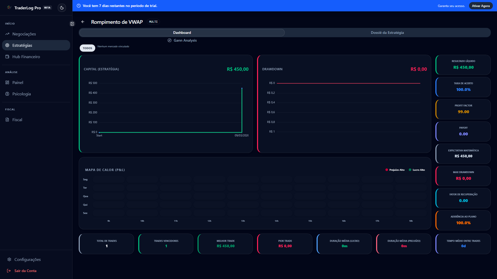

### 4.3. Financial Hub (Treasury)
Centralized management of the capital that feeds your trading accounts. Control of contributions, withdrawals and the margin operated between different brokers. The screen displays:

* **Main Metrics (Top KPIs):**
  * **Total Equity (BRL):** The consolidated sum of all capital available in your accounts, converted to Reais.
  * **Balance in BRL / Balance in USD:** The available balance segregated by currency.
  * **Result of the Month:** Summary of financial performance in the current month.
* **Evolution Chart:** Displays a curve of the Evolution of Equity and Contributions, allowing you to apply quick filters by broker (e.g. Itaú, XP, Interactive Brokers) to isolate the growth of each account.
* **Transaction Statement:** A hierarchical list grouped by Month and Week with all transactions, trade by trade or contributions/withdrawals. Includes filters by Account, Entry Type (Input/Output), and search by description.

### 4.4. Psychology (Mind)
The mathematical cross between your emotional states and your real PnL. Understand how your emotions impact (positively or negatively) your financial results.

* **Behavioral Metrics:**
  * **Best Mental State:** The emotion in which your performance is statistically the most profitable.
  * **Worst Mental State:** The emotion linked to the greater accumulation of financial loss.
  * **The Cost of Tilt:** The exact dollar amount of your losses when operating outside the zone of control or dominated by negative emotions.
  * **Journal Records:** The total number of psychological assessments completed on the platform.
* **Graphic Analysis:**
  * **Financial Result by Emotion:** Bar graph that quantifies the balance generated associated with each emotion (Ex: Patience vs Anxiety vs Anger).
  * **Efficiency %:** Percentage graph showing the concentration of victories by emotional state.
  * **Correlation: Emotion x Daily Result:** Graph combining the rise and fall of the emotional intensity line versus the Daily Result bars.
* **Monitoring Tables:**
  * **Behavioral Mapping:** List grouped by month/week showing the predominant *Score* and the dominant Emotion of the period.
  * **Records and Direct Entries:** Detailed table of each trade record with Date, Internal State, Intensity, Adherence Score (0-10).

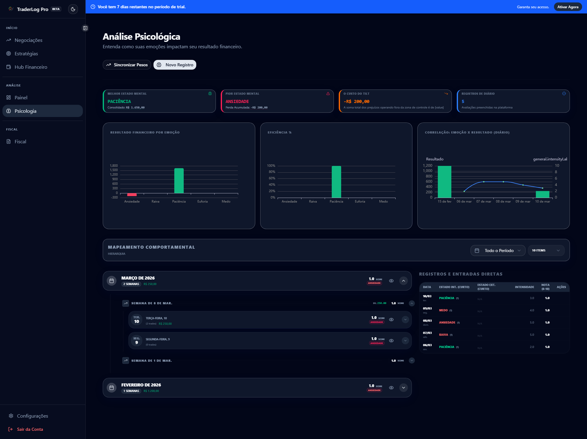

### 4.5. Tax (IRPF Center)
The tax engine for the Brazilian market (B3). Track and consolidate your monthly notes and retentions, separating Day Trade and Swing Trade.

* **Tax Dashboard (KPIs):**
  * **Tax Due (Year):** The accumulated amount payable this year based on your net profit subject to taxation.
  * **Total Paid (Year):** The sum of the bills already paid.
  * **Pending Guides:** Alert of the number of guides that are overdue or that require our attention, with a button to "Check".
  * **Accumulated Losses:** A break in your current outstanding balances (rights to be written off in the future), separated purely into "Day Trade" or "Swing Trade".
* **Tax Evolution (Graph):** Monthly visual control throughout the year superimposing the IR Due versus the paid volume.
* **DARFs Panel:** Access to your consolidated invoice management for storing receipts (uploading and document management).
* **Collections History:** Monthly table of assessments generated in the specified year with status, textual search and filtering.

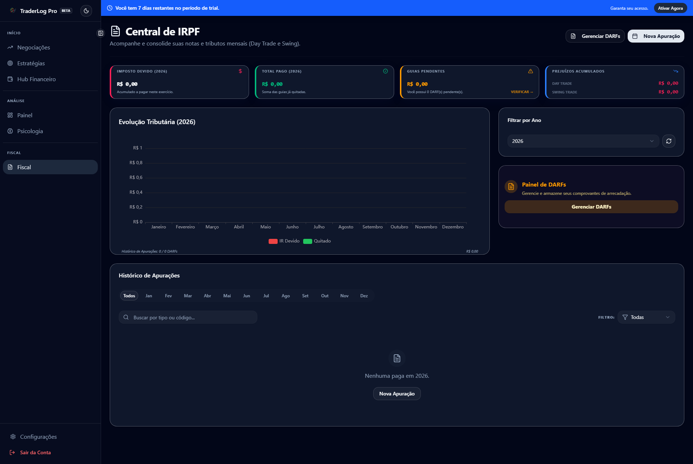

---

## 5. System Settings

### 5.1. Integrations
Configure API keys for external data.

### 5.2. Database
Management and backup of encrypted local data.

---
*(End of Manual - v1.1 - Standardized)*
